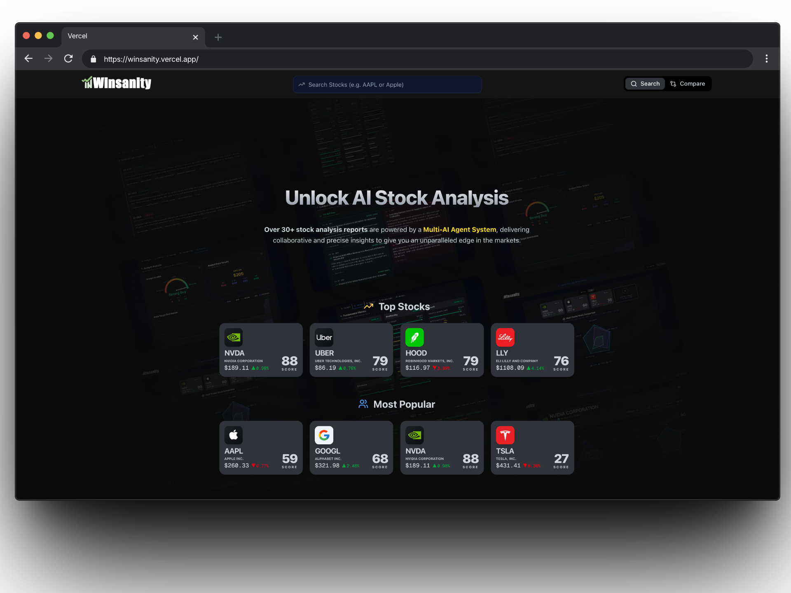
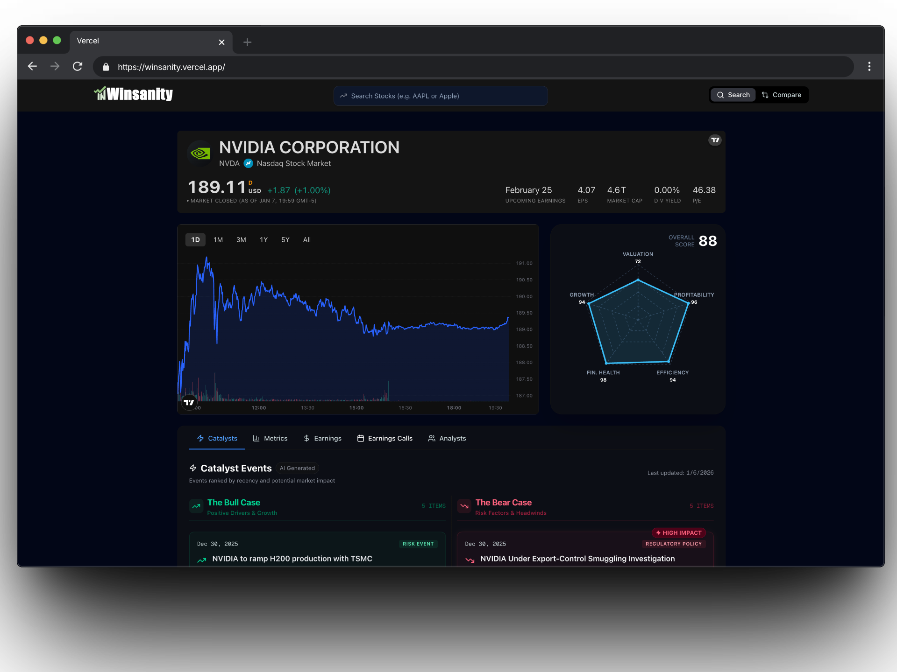
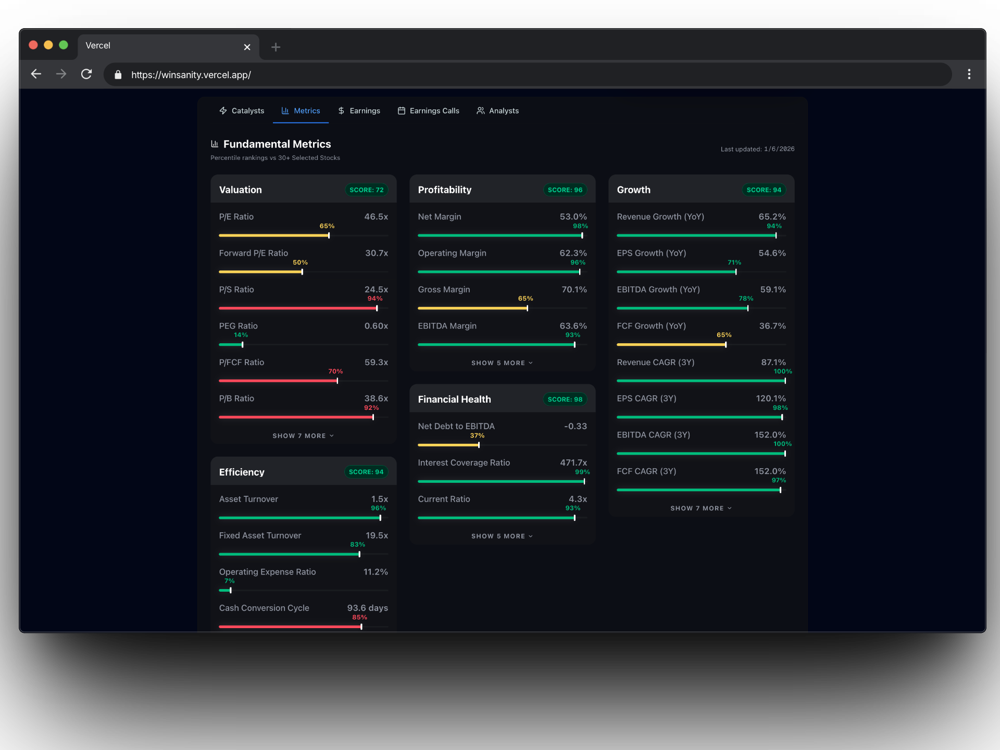
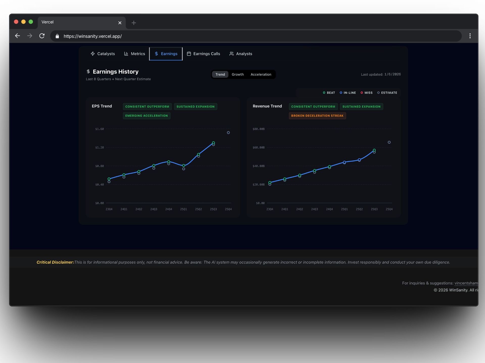
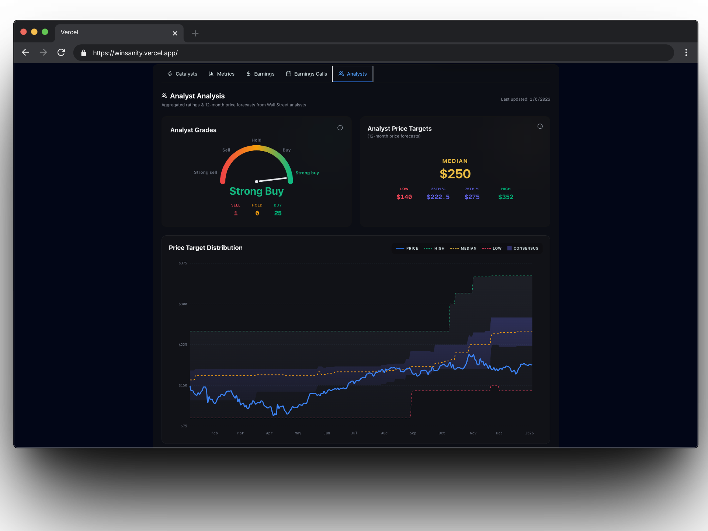
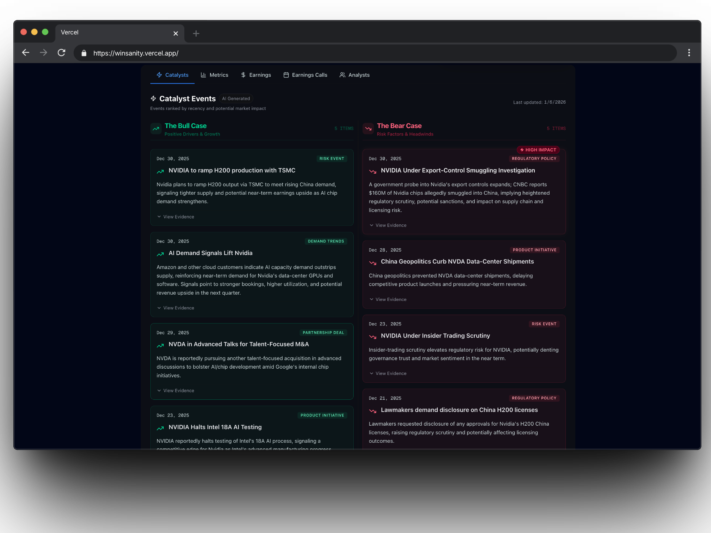
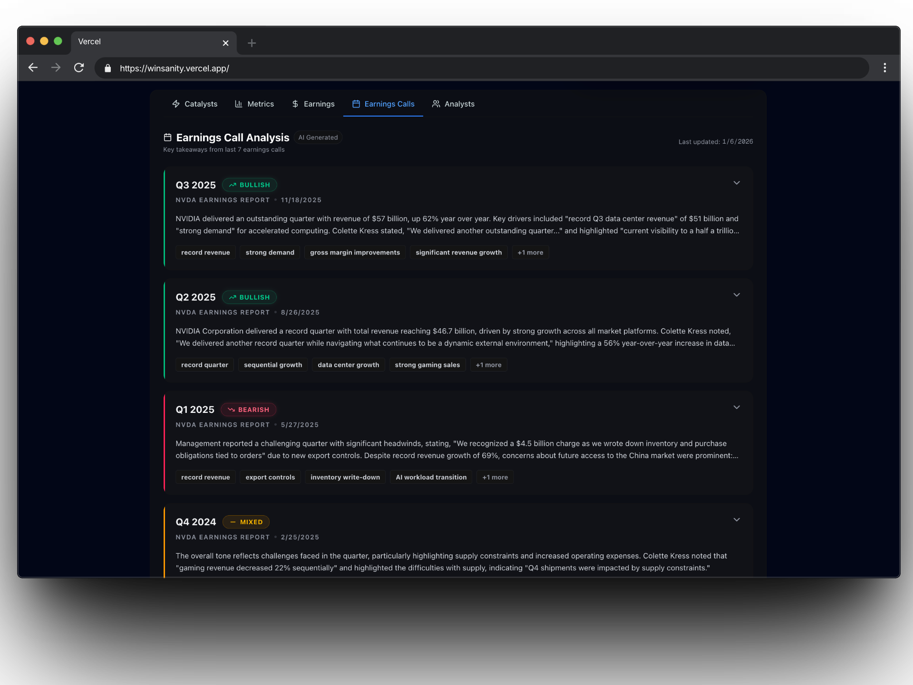
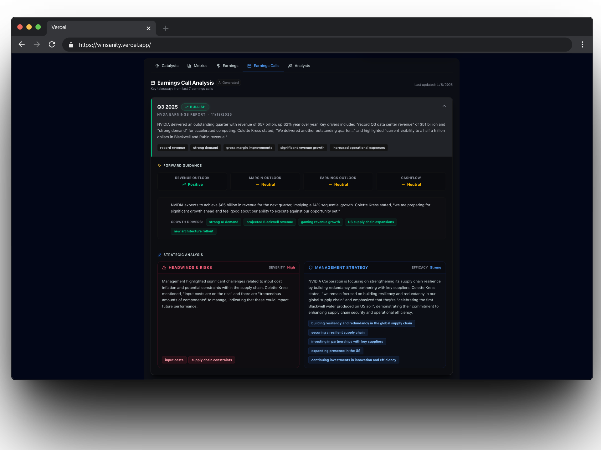
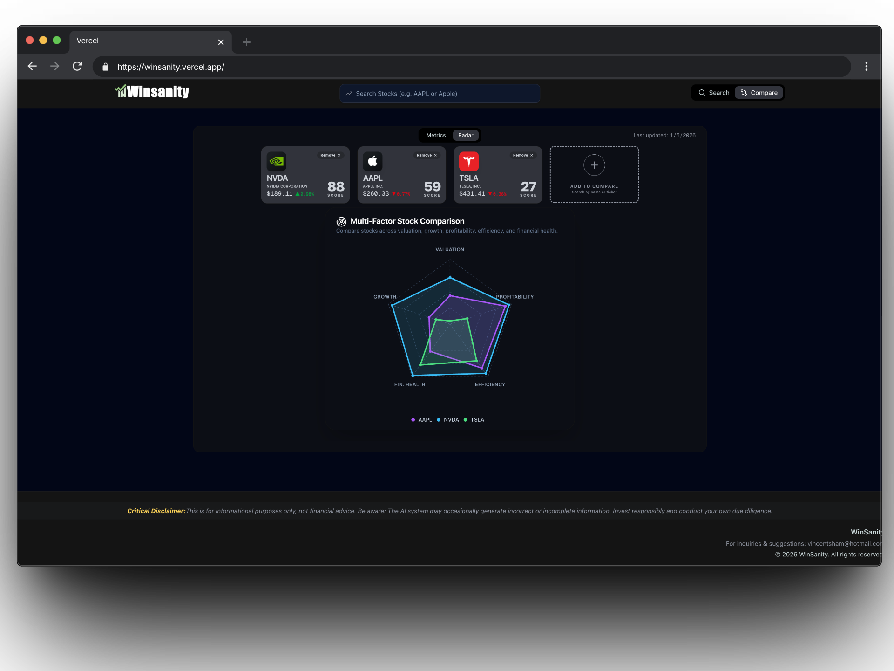
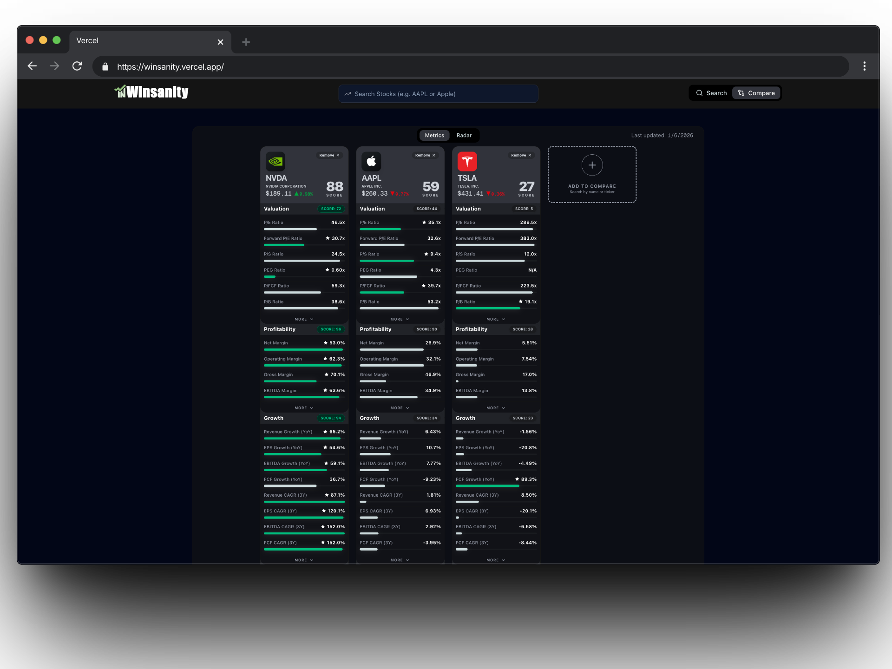

# 🧠 Winsanity

### 🌐 **Live App:** [https://winsanity.vercel.app](https://winsanity.vercel.app)

> **AI-Powered Stock Analysis & Market Intelligence System**

**Winsanity** is a financial intelligence platform that combines quantitative precision with qualitative AI insights. It automates due diligence by ranking stocks against a high-cap cohort and using AI agents to generate structured narrative reports.

---

## 📸 Webpage Preview

---

## 🚀 Key Features

### **1. The "Win Score" Engine (Algorithmic)**
A deterministic scoring system (0-100) that calculates a stock's strength based on **percentile rankings**.
* **Methodology:** Every stock is ranked against a cohort of 30+ high market cap stocks.
* **5-Pillar Analysis:** Aggregates performance across **Valuation, Profitability, Growth, Efficiency, and Financial Health**.

### **2. AI-Powered Narrative Analysis**
* **Catalyst Agents:** Scrape and analyze news to separate "Noise" from "Signal," generating the **Bull Case** and **Bear Case**.

* **Earnings Agents:** Parse thousands of lines of earnings call transcripts to extract management sentiment and key takeaways.

### **3. ⚔️ Competitive Comparison**
* **Multi-Ticker Analysis:** Instantly compare stocks (e.g., NVDA vs. TSLA vs. AAPL) side-by-side.
* **Radar Visuals:** Uses **Recharts Radar Charts** to visually overlay the percentile strengths of multiple assets.

---

## 🛠️ Technical Architecture

Winsanity employs a **Hybrid Architecture**: a Python-based ETL pipeline for heavy analysis and a Next.js frontend for high-performance serving.

| Component | Technology | Role |
| :--- | :--- | :--- |
| **Frontend** | **Next.js 16 (React 19)** | Server Components, App Router, Server Actions. |
| **ETL Pipeline** | **Python** | Background orchestration of data ingestion, normalization, and AI agents. |
| **Database** | **PostgreSQL** | Relational storage divided into `raw` (ingest), `core` (normalized), and `mart` (serving) schemas. |
| **Visualization** | **Recharts** | Renders interactive price charts and **Radar comparison plots**. |
| **AI Layer** | **Multi-Agent System** | Dedicated agents for *News Classification* and *Transcript Parsing*. |
| **Styling** | **Tailwind CSS v4** | Rapid, utility-first UI design with the latest engine. |

---

## 🧠 How It Works: The Data Engine

Winsanity operates on a continuous intelligence loop separating computation from delivery:

1.  **The Intelligence Layer (Python ETL)**:
    *   **Extract:** Fetches raw financials, news, and transcripts from external APIs.
    *   **Normalize:** Cleans and structures data into a `core` schema.
    *   **Analyze (AI):** Agents read unstructured text (news/transcripts) to extract sentiment, risks, and catalysts.
    *   **Compute (Quant):** Calculates 30+ ratios and determines **Percentile Ranks** against the peer group.

2.  **The Serving Layer (Next.js)**:
    *   The Web App connects to the pre-computed `mart` schema.
    *   Since heavy analysis is done upstream, the dashboard offers **sub-second page loads** and instant comparisons using Server Components.

---

## ⚠️ Disclaimer

*This application is for informational purposes only. The AI system provides analysis based on available data and may occasionally generate incorrect or incomplete information. Always conduct your own due diligence before investing.*

---

## 📬 Contact

Feedback or Feature Requests?
Email: [vincentsham@hotmail.com](mailto:vincentsham@hotmail.com)

© 2026 Winsanity.
